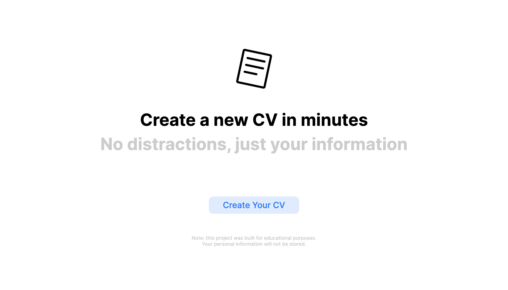
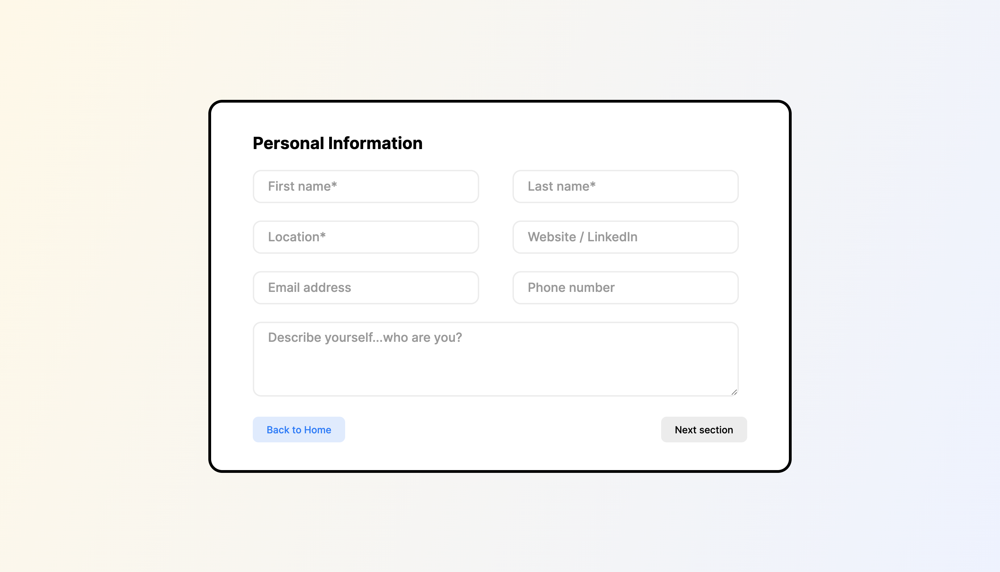

# CV Application

### This is a web application that allows you to create a CV. 

## Live Demo

Insert Link

**Note:** This website is best viewed on high res screens (1080p and up). Check the [improvements section](#improvements) for future updates.

## Project Details

### Prompt

From The Odin Project's [curriculum](https://www.theodinproject.com/courses/javascript/lessons/cv-application). 

### Built With

- ReactJS (bootstrapped with [Create React App](https://github.com/facebook/create-react-app))
- HTML5
- CSS3

## Improvements

Future features / opportunities for improvement:

- Enhance error handling (e.g., replace alerts with inline error)
- Add animations (e.g., carousel effect on prev/next page button click)
- Make website responsive